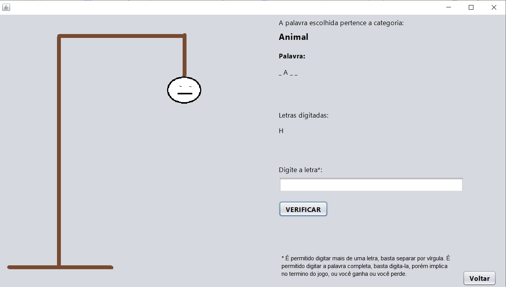

# Games

Jogos desenvolvidos durante a faculdade.

##Jogo da Forca - Hangman Game

Na versão inicial, o jogo escolhe uma palavra de modo aleatória.
Cada palavra pertence a uma categoria, que é mostrado em tela.
As letras que foram erradas também são exibidas em tela.

A pessoa poderá escrever a palavra inteira caso saiba (mesmo que tenha acertado letras, deve escrever a palavra inteira) ou poderá digitar as letras. 
Tem duas formas de digitar as letras, pode ser uma por uma ou se a pessoa (usuário) preferir digitar duas letras, pode separá-las por vírgula

 
